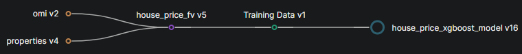

# Italian House Price Prediction System

## Features 

### Feature backfill 

* [Notebook](./notebooks/1_house_price_feature_backfill.ipynb)
* properties feature group.
* omi feature group.

### Model training 

* [Notebook](./notebooks/3_house_price_training_pipeline.ipynb)
* feature view combining features from both feature groups.
* XGBRegressor regressor trained with randomized search.

### Online inference

* [Notebook](./notebooks/4_house_price_online_inference.ipynb)
* [App](./src/app/app.py)
* [UI](https://huggingface.co/spaces/jackma-00/house-price-app)