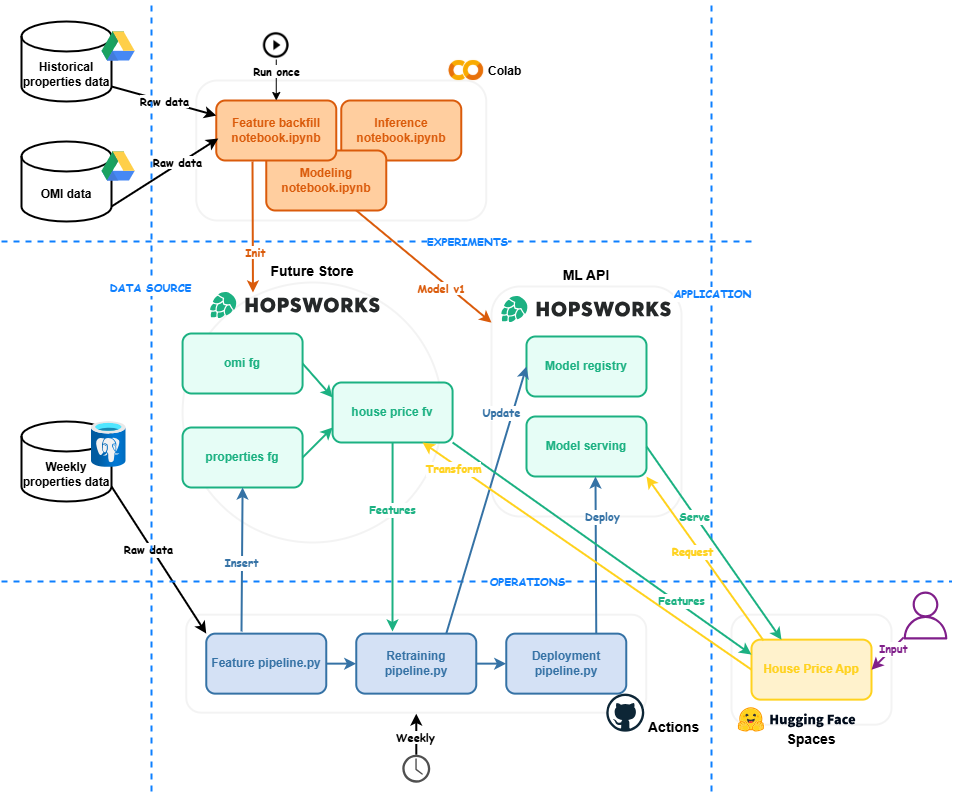

# 🏠 Italian House Price Prediction System

## Table of Contents
* [📚 Introduction](#-introduction)
* [🏗️ Architecture](#️-architecture)
* [📝 Notebooks Description](#-notebooks-description)
* [🔄 Pipelines Description](#-pipelines-description)
* [💻 App Description](#-app-description)
* [📊 Results](#-results)
* [🔧 Project Setup Guide](#-project-setup-guide)
* [🖥️ Software Used](#️-software-used)

## 📚 Introduction
This repository is related to the **Final Project** of the course [ID2223 Scalable Machine Learning and Deep Learning](https://www.kth.se/student/kurser/kurs/ID2223?l=en) at [KTH](https://www.kth.se). The **project proposal** can be found [here](./docs/jmaragna-amsaleh-project-proposal.pdf).

This project aims to create a *Machine Learning system* for *predicting house prices in Italy*. It features a user-friendly [interface](https://huggingface.co/spaces/jackma-00/house-price-app) where users can input property details, such as square footage, floors, and location, to receive accurate price estimates.  
The predictive model will be trained on historical data scrapped from [Immobiliare.it](https://www.immobiliare.it/) and insights from the [Osservatorio del Mercato Immobiliare](https://www.agenziaentrate.gov.it/portale/web/guest/schede/fabbricatiterreni/omi/banche-dati/quotazioni-immobiliari) (OMI), Italy’s Real Estate Market Observatory. Predictions will combine user inputs with additional features from OMI to improve accuracy.  
To ensure the model remains relevant and reflects market trends, it will be updated weekly with newly scraped data. This continuous update process will enable the system to capture subtle fluctuations in Italy’s housing market.  
The project is made possible by [Houseplus](https://www.linkedin.com/company/houseplusitalia/), an Italian startup owned by the [86k holding](https://www.linkedin.com/company/86k/) company. Houseplus will provide exclusive access to high-quality, processed data sourced from Immobiliare.it, ensuring a robust foundation for model training and prediction.

In **this repository** you can find:
- [**Notebook Experiments**](./src/notebooks/): This directory contains the notebooks used to test and validate the code implemented in the pipelines. Additionally, the initial feature backfill for the feature stores was performed exclusively within these notebooks.
- [**Machine Learning Serverless Pipelines**](./src/pipelines/): These pipelines are triggered weekly by GitHub Actions. They handle retrieving new data, inserting it into the feature store, retraining the model to capture the latest trends, and deploying the new model version, ready to serve inference requests.
- [**Graphical User Interface on Gradio**](./src/app/): A user-friendly interface where you can input house characteristics and receive an estimated price. The UI is hosted on [Hugging Face](https://huggingface.co/spaces/jackma-00/house-price-app).

The project was developed using **Jupyter Notebooks** on **Google Colab**, while the pipelines were implemented in **Python** and tested both locally and on **Hugging Face Spaces**. The ML system is powered by [**Hopsworks**](https://www.hopsworks.ai/), which serves as the [*feature store*](https://docs.hopsworks.ai/latest/concepts/fs/), [*feature view*](https://docs.hopsworks.ai/latest/concepts/fs/feature_view/fv_overview/), [*model registry*](https://docs.hopsworks.ai/latest/concepts/mlops/registry/), and [*model deployment*](https://docs.hopsworks.ai/latest/concepts/mlops/serving/) platform. These functionalities are crucial to the project, enabling it to be classified within an **MLOps** context.

## 🏗️ Architecture

## 📝 Notebooks Description
### 📊 Feature Backfill Notebook
[Here](./src/notebooks/1_house_price_feature_backfill.ipynb) is where **historical data**, provided by Houseplus through a shared Google Drive folder, is imported into the system, preprocessed, and fed into two feature groups: *properties* and *omi*.

### 🧠 Training Notebook
[This](./src/notebooks/3_house_price_training_pipeline.ipynb) is where the feature view is used to retrieve data from both feature groups and transform it into a suitable format for model training.  
The selected model for predicting house prices is an [**XGBoost**](https://xgboost.readthedocs.io/en/stable/index.html) regressor, trained using a [**Randomized search**](https://scikit-learn.org/1.5/modules/generated/sklearn.model_selection.RandomizedSearchCV.html) on hyper parameters.

### ⚙️ Online Inference Notebook
[Here](./src/notebooks/4_house_price_online_inference.ipynb) is where the model inference was tested. The model was first deployed and validated through an inference request. The input data must conform to the schema of the **properties feature group**, ensuring compatibility with the model's requirements.  
User-provided data does not include **OMI data**, as these are automatically integrated into the feature vector through the **feature view** component. This approach enriches the user-input data with additional predictive features, enhancing the model's accuracy and effectiveness.  
Lastly, the model was interactively tested by developing a user-friendly interface using [**Gradio**](https://www.gradio.app/), enabling intuitive interaction and real-time predictions.

### 📅 Weekly Feature Notebook
[This](./src/notebooks/2_house_price_weekly_feature_pipeline.ipynb) is where the weekly data fetch is tested, along with the subsequent model retraining and deployment update.

## 🔄 Pipelines Description
The pipelines are run on a weekly schedule through GitHub Actions. Upon the success of one pipeline, the next one is triggered automatically.

### 🏗️ Feature Pipeline
[This](./src/pipelines/01_feature_pipeline.py) pipeline runs weekly and fetches data from Houseplus's API to obtain the latest scraped data. The data is then preprocessed and fed into the **properties feature group**, preparing it for the next machine learning modeling phase.

### 🔄 Retraining Pipeline
[This](./src/pipelines/02_retraining_pipeline.py) pipeline runs weekly upon the successful completion of the previous *Feature pipeline*. It first retrieves the feature view to access the **latest data**, prepares it for training, and **tunes** the XGBoost regressor to capture the latest trends in the Italian real estate market. The model is then evaluated and saved to the model registry, **replacing** the previous version.

### 🚀 Deployment Pipeline
[This](./src/pipelines/03_deployment_pipeline.py) pipeline runs weekly upon the successful completion of the previous *Retraining pipeline*. It retrieves the **latest trained model**, **deletes** the old deployment, and **deploys** the new version, making it available for queries by our application.  
Note that the model serving and the application are **decoupled**, allowing for **continuous model updates** without requiring a new version of the UI application. The application simply pings the same **deployment endpoint**, which automatically serves the updated model when it is changed.

## 💻 App Description
The app implemented in [app.py](./src/app/app.py) is a graphical user interface (GUI) for predicting house prices in Italy. It uses the Gradio library to create an interactive web interface where users can input various details about a house and receive an estimated price.

Key features of the app:
* **Inputs**: The interface accepts multiple inputs related to house characteristics, such as the number of bedrooms, building year, surface area, location (latitude and longitude), and other features like luxury status, energy class, and heating type.
* **Outputs**: The predicted house price is displayed as the output.
* **Examples**: The app provides example data to help users understand how to use the interface.
* **Integration**: The app integrates with various utility functions from [utils/functions.py](./src/app/utils/functions.py) to handle data preparation, model inference, and saving predictions for monitoring.

## 📊 Results
### 🖥️ Graphic User Interface
The **results of our work can also be viewed** on the [GUI](https://huggingface.co/spaces/jackma-00/house-price-app) hosted on Hugging Face. Users can enter house details and press submit for processing. In a matter of seconds, the prediction will be returned and displayed under the price text box. For testing purposes, unless you have accurate information, it is recommended to select one of the provided examples, as the form will be automatically filled in.

### 📈 Model Performance

| Metric | Value |
|--------|-------|
| **R-squared** | 0.8277 |
| **MSE** | 26,982,919,338.54 |

The high **R-squared** value indicates good predictive power, especially for a real-world regression problem. This indicates the model fits the data well and is able to predict house prices with a significant level of accuracy. However, the **MSE** could benefit from further optimization. It’s important to note that the scale of the data differs significantly from feature to feature, which may impact this metric.

### 🔮 Future Improvements
- Apart from hyperparameter optimization, very little feature engineering was applied. To improve the **MSE**, proper scaling of the data could be implemented.
-  Model updates are performed weekly using the entire historical dataset combined with newly scraped data. This approach aims to capture the latest trends in the Italian housing market.  
However, a more thorough update process could be considered to enhance the effectiveness of the ML system. This could include:  
   - **Monitoring the statistical properties of new data** to ensure consistency and detect anomalies.  
   - **Tracking prediction performance** on unseen data to identify potential drift.  
   - **Incorporating advanced evaluation metrics** for a more robust assessment of the model's accuracy over time.

## 🔧 Project Setup Guide

To run this project, follow the steps below:

1. **Create Accounts**  
   - You will need accounts on both [Hopsworks](https://www.hopsworks.ai/) and [Hugging Face](https://huggingface.co/).
   
2. **Obtain API Keys**  
   - Register for an API key on both Hopsworks and Hugging Face. You will need to add these API keys to your GitHub secrets for secure access during the deployment process.

3. **Configure GitHub Actions**  
   - Configure the GitHub Actions workflow provided in the repository. This ensures that the pipelines are triggered automatically and run on a weekly schedule.

4. **Set Up Hugging Face Space**  
   - Create a new **Hugging Face Space** for hosting the UI. Connect this space as a remote repository to the GitHub repository to enable seamless integration with your deployment pipeline.
   - Also, set the **HOPSWORKS_API_KEY** in the Hugging Face Space’s environment variables to allow the UI to interact with the Hopsworks platform securely.

5. **Run the Notebook**  
   - Open the provided notebook in **Google Colab** to create the necessary Hopsworks infrastructure. This includes setting up **feature groups**, **feature views**, and other required elements within Hopsworks.

6. **Grant Access for Weekly Data Fetch**  
   - Make sure that the API has been granted the necessary permissions for weekly data fetching. This ensures the model is trained with the latest data.

## 🖥️ Software Used
[**Visual Studio Code**](https://code.visualstudio.com/) - IDE

[**Google Colab**](https://colab.research.google.com/) - running environment

[**HuggingFace**](https://huggingface.co/) - GUI hosting

[**Gradio**](https://www.gradio.app/) - GUI

[**GitHub Actions**](https://github.com/features/actions) - run weekly pipelines

[**Hopsworks**](https://www.hopsworks.ai/) - MLOps platform

[**Google Drive**](https://workspace.google.com/) - Historical data storage

[**Houseplus API**]() - Weekly data retrieval
